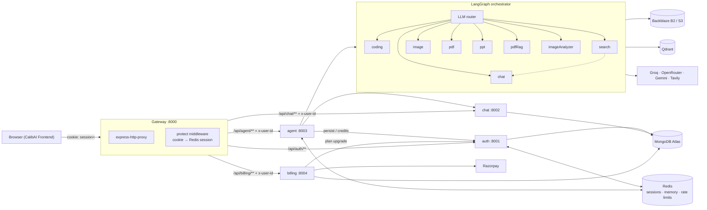

<div align="center">

# CalibAI — Backend

### API gateway + AI microservices — LangGraph multi-agent orchestration, Redis sessions, RAG, and credit-based billing.

[](https://nodejs.org/)
[](https://expressjs.com/)
[](https://www.mongodb.com/)
[](https://redis.io/)
[](https://langchain-ai.github.io/langgraph/)
[](https://www.docker.com/)
[](https://github.com/features/actions)

[](#license)
[](#contributing)

</div>

---

## 📹 Demo

<!-- 
===========================================================================
PLACEHOLDER — APP WALKTHROUGH VIDEO
===========================================================================
Replace the comment block below with one of the following once the 
screen recording is ready:

Option A — GitHub-hosted video (drag & drop into the repo, e.g. /docs/demo.mp4):
  <video src="docs/demo.mp4" controls width="100%" muted autoplay loop></video>

Option B — YouTube / Loom embed:
  [](https://www.youtube.com/watch?v=YOUR_VIDEO_ID)

Option C — GIF:
  

Suggested recording script (≈60–90s):
  1. docker compose up redis → start gateway + 4 services
  2. Sign in through the frontend → session cookie created in Redis
  3. Send a coding prompt → LangGraph router dispatches to the coding agent
  4. Artifact returned + persisted in Mongo; credits deducted
  5. Upload a PDF → pdfRag chunks, embeds into Qdrant, answers from the doc
  6. Razorpay test payment → plan upgrade propagates through auth → session
===========================================================================
-->

<div align="center">
  <!-- 🎬 <b>Demo video coming soon.</b> -->
  <i>Demo walkthrough coming soon.</i>
</div>

---

## 🧭 Overview

CalibAI Backend is the server side of **CalibAI** — an AI assistant with seven specialized agents. It is split into **five independently containerized Node.js services** behind a thin **API gateway**, so each domain (auth, chat, agent, billing) can be built, deployed, and scaled on its own.

The heart of the system is the **agent service**: a **LangGraph `StateGraph`** that routes each request through an LLM intent classifier to one of eight agents — chat, coding, web search, image, PDF, PPT, PDF-RAG, and image analysis — with model selection per agent across Groq, OpenRouter, and Google Gemini.

> **Companion repo:** [`CalibAI-Frontend`](https://github.com/Regestrac/CalibAI-Frontend) — React 19 + Vite + Redux Toolkit chat console.

---

## 🏗 Architecture



| Service | Port | Responsibility |
| --- | --- | --- |
| **gateway** | 8000 | CORS, cookie parsing, `protect` auth, reverse proxy, `x-user-id` injection |
| **auth** | 8001 | Firebase token verification, user upsert, Redis sessions, plan + credit ledger |
| **chat** | 8002 | Conversation/message CRUD, artifact persistence, soft delete |
| **agent** | 8003 | LangGraph orchestration, 8 agents, rate limits, file handling, storage |
| **billing** | 8004 | Razorpay orders, signature verification, plan upgrades |

Shared code lives in `shared/redis` and is copied into every Docker image.

---

## ✨ Features

### 🤖 Multi-Agent Orchestration (LangGraph)
- **Conditional `StateGraph`** — `__start__ → router` then a conditional edge dispatching to one of 8 agents, plus a special `search → chat` edge that injects web results as grounding context.
- **LLM intent router** — classifies prompts, output sanitized against a whitelist with a safe `chat` fallback.
- **Fast paths before the LLM** — explicit agent selection wins, `application/pdf → pdfRag`, `image/* → imageAnalyzer`.
- **Model-per-agent fan-out** — Groq `openai/gpt-oss-120b` for chat, OpenRouter `minimax-m3` for coding, Groq `qwen3.8-27b` for routing/search/RAG, Gemini `flash-lite` for vision.

### 🧠 The Eight Agents
| Agent | What it does |
| --- | --- |
| `chat` | General assistant with Redis-backed conversation memory and optional web context |
| `coding` | Intent classifier (`GENERATION / REVIEW / EXPLANATION / DEBUGGING / OPTIMIZATION / CONVERSION / DOCUMENTATION`) → multi-file JSON **artifacts** for live preview |
| `search` | Tavily web search (5 results + images) → forwarded to `chat` for grounded answering |
| `image` | LLM prompt engineering → Pollinations.ai generation → B2 upload → 24h presigned URL |
| `pdf` | LLM outline (JSON) → **PDFKit** A4 render → B2 → 24h URL |
| `ppt` | LLM outline (JSON) → **pptxgenjs** 6-slide deck with randomized themes → B2 → 24h URL |
| `pdfRag` | `pdf-parse` → `RecursiveCharacterTextSplitter` (1000/100) → **Qdrant** + Gemini embeddings → score-thresholded top-3 → grounded answer |
| `imageAnalyzer` | Multimodal Gemini vision — OCR, chart/table explanation, image Q&A |

### 🔐 Auth & Sessions
- Firebase Admin `verifyIdToken()` → find-or-create user → **`crypto.randomUUID()` session** stored in Redis (7-day TTL) with a reverse index for live patching.
- Session delivered as an **httpOnly, `secure`, `sameSite: none`** cookie — no self-issued JWT, no passwords on our side.
- Gateway `protect` middleware resolves the cookie → session blob → injects **`x-user-id`** into proxied requests.

### 🔴 Redis — Three Roles in One Store
1. **Session store** with reverse index (`user-session-<userId>`) so payments can rewrite a live session without re-login.
2. **Conversation memory cache** — hydrated from Mongo on first use (24h TTL), rolling **20-turn window** appended after every response.
3. **Rate limiter** — fixed-window `INCR rate:<userId>:<agent>` + `EXPIRE 60`; per-agent ceilings (chat 20, image 10, coding/pdf/ppt/search 5, pdfRag/imageAnalyzer 3) returning structured **429** payloads with human-readable `retryAfter`.

### 💳 Credit Economy
- Per-agent costs: `chat 1 · search 3 · coding 12 · pdf 6 · ppt 8 · image 5 · pdfRag 10 · imageAnalyzer 10`.
- Enforced as `checkAgentLimit → checkCredits → LLM call → deductCredits`.
- Every AI response returns `remainingCredits` so the UI updates immediately.

### 💰 Billing (Razorpay)
- `POST /billing/create` → order for **Free ₹0/100 · Starter ₹199/500 · Pro ₹399/1000** (30-day validity) → `Payment` recorded as `created`.
- `POST /billing/verify` → **HMAC-SHA256** signature check → `paid` → auth `/update-plan` → live Redis session rewritten.

### 📦 Storage & Files
- **Multer** disk uploads filtered to `application/pdf` + `image/*`, 20 MB limit, temp files unlinked in `finally`.
- **Dual S3-compatible layer** — Backblaze B2 in active use, AWS S3 configured as fallback.
- Generated PDFs/PPTs/images are built as **in-memory Buffers** and pushed straight to B2 with **24-hour presigned URLs**.

### 🗄 Data Model (MongoDB / Mongoose 9)
- `User` — `firebaseUid` (unique), plan, credits/totalCredits, `planExpiresAt`
- `Conversation` — title, userId, `deletedAt` soft delete
- `Message` — role, content, `images[]`, **`artifacts[{id, type, title, files[]}]`**, `deletedAt`
- `Payment` — orderId, paymentId, amount, credits, plan, status (`created|paid|failed`)

---

## 🛠 Tech Stack

| Layer | Choice |
| --- | --- |
| Runtime | Node.js 20 (native `--watch`, `--env-file`) |
| Framework | Express 5.2.1 (ESM, plain JavaScript) |
| Gateway | `express-http-proxy`, `cors`, `cookie-parser`, `morgan` |
| Database | MongoDB Atlas + Mongoose 9 |
| Cache / state | Redis via `ioredis` |
| AI | LangChain, LangGraph, Groq, OpenRouter, Google Gemini |
| Search | Tavily |
| Vector DB | Qdrant |
| Auth | firebase-admin |
| Payments | Razorpay |
| Documents | `pdf-parse`, PDFKit, `pptxgenjs` |
| Storage | AWS S3 + Backblaze B2 (presigner) |
| Uploads | Multer |
| CI/CD | GitHub Actions → GHCR → Render deploy hooks |
| Containers | Docker (`node:20-alpine`), docker-compose (Redis) |

---

## 🚀 Getting Started

### Prerequisites
- **Node.js 20+** and npm
- **Docker** (for Redis) — or a local Redis on `6379`
- **MongoDB Atlas** connection string
- **Firebase service account** (client email + private key)
- API keys: **Groq**, **OpenRouter**, **Google AI**, **Tavily**, **Qdrant**, **Razorpay**, **Backblaze B2** (AWS optional)

### 1. Install

```bash
git clone https://github.com/Regestrac/CalibAI-Backend.git
cd CalibAI-Backend

# install deps for every package (root, gateway, shared usage, and all services)
npm install --prefix gateway
npm install --prefix services/auth
npm install --prefix services/chat
npm install --prefix services/agent
npm install --prefix services/billing
```

### 2. Start Redis

```bash
docker compose up -d redis      # redis on localhost:6379
```

### 3. Configure environment

Copy each service's `.env.example` to `.env` and fill it in:

```bash
cp gateway/.env.example        gateway/.env
cp services/auth/.env.example  services/auth/.env
cp services/chat/.env.example  services/chat/.env
cp services/agent/.env.example services/agent/.env
cp services/billing/.env.example services/billing/.env
```

<details>
<summary><b>gateway/.env</b></summary>

| Variable | Description |
| --- | --- |
| `PORT` | `8000` |
| `AUTH_SERVICE` | e.g. `http://localhost:8001` |
| `CHAT_SERVICE` | e.g. `http://localhost:8002` |
| `AGENT_SERVICE` | e.g. `http://localhost:8003` |
| `BILLING_SERVICE` | e.g. `http://localhost:8004` |
| `FRONTEND_URL` | e.g. `http://localhost:5173` (CORS origin) |
| `REDIS_URL` | e.g. `redis://localhost:6379` |

</details>

<details>
<summary><b>services/auth/.env</b></summary>

| Variable | Description |
| --- | --- |
| `PORT` | `8001` |
| `MONGO_DB_URI` | MongoDB Atlas connection string |
| `REDIS_URL` | Redis connection string |
| `FIREBASE_CLIENT_EMAIL` | Service account email |
| `FIREBASE_PRIVATE_KEY` | Service account key (`\n`-escaped) |
| `FIREBASE_PROJECT_ID` | Firebase project id |

</details>

<details>
<summary><b>services/chat/.env</b></summary>

| Variable | Description |
| --- | --- |
| `PORT` | `8002` |
| `MONGO_DB_URI` | MongoDB Atlas connection string |

</details>

<details>
<summary><b>services/agent/.env</b></summary>

| Variable | Description |
| --- | --- |
| `PORT` | `8003` |
| `MONGO_DB_URI` | MongoDB Atlas connection string |
| `GROQ_API_KEY` | Groq LLM access |
| `TAVILY_API_KEY` | Web search |
| `OPENROUTER_API_KEY` | Coding agent model |
| `GOOGLE_API_KEY` | Gemini embeddings + vision |
| `CHAT_SERVICE` | e.g. `http://localhost:8002` |
| `AUTH_SERVICE` | e.g. `http://localhost:8001` |
| `REDIS_URL` | Redis connection string |
| `AWS_BUCKET_NAME` / `AWS_REGION` / `AWS_ACCESS_KEY_ID` / `AWS_ACCESS_KEY` | S3 fallback storage |
| `B2_BUCKET_NAME` / `B2_ENDPOINT` / `B2_REGION` / `B2_KEY_ID` / `B2_APPLICATION_KEY` | Backblaze B2 storage |
| `QDRANT_API_KEY` / `QDRANT_URL` | Vector DB for PDF RAG |

</details>

<details>
<summary><b>services/billing/.env</b></summary>

| Variable | Description |
| --- | --- |
| `PORT` | `8004` |
| `MONGO_DB_URI` | MongoDB Atlas connection string |
| `RAZORPAY_KEY_ID` | Razorpay key id |
| `RAZORPAY_KEY_SECRET` | Razorpay secret (used for HMAC verification) |
| `AUTH_SERVICE` | e.g. `http://localhost:8001` |

</details>

### 4. Run the services

In five separate terminals (each uses Node's native watcher):

```bash
npm run dev --prefix gateway         # :8000
npm run dev --prefix services/auth   # :8001
npm run dev --prefix services/chat   # :8002
npm run dev --prefix services/agent  # :8003
npm run dev --prefix services/billing # :8004
```

Then start the [frontend](https://github.com/Regestrac/CalibAI-Frontend) with `VITE_SERVER_URL=http://localhost:8000`.

### 5. Verify

```bash
curl http://localhost:8000/
# {"success":true,"message":"Gateway request success."}
```

---

## 📡 API Reference

### Gateway — `:8000`
| Method | Path | Auth | Description |
| --- | --- | --- | --- |
| * | `/api/auth/**` | public | Proxied to auth service |
| * | `/api/chat/**` | `protect` | Proxied with `x-user-id` |
| * | `/api/agent/**` | `protect` | Proxied with `x-user-id` |
| * | `/api/billing/**` | `protect` | Proxied with `x-user-id` |
| GET | `/api/me` | `protect` | Current session payload |

### Auth — `:8001`
| Method | Path | Description |
| --- | --- | --- |
| POST | `/login` | Verify Firebase token → create Redis session → set cookie |
| POST | `/logout` | Destroy session + clear cookie |
| POST | `/update-plan` | *internal* — apply plan upgrade + credits |
| POST | `/check-credits` | *internal* — pre-flight credit check |
| POST | `/deduct-credits` | *internal* — deduct cost, refresh session |

### Chat — `:8002`
| Method | Path | Description |
| --- | --- | --- |
| GET | `/create-conversation` | Create a conversation |
| GET | `/get-conversations` | List conversations (`updatedAt` desc) |
| POST | `/update-conversation` | Rename `{id, title}` |
| POST | `/save-message` | Persist a message incl. `images` + `artifacts` |
| GET | `/get-messages/:conversationId` | Message history |
| DELETE | `/delete-conversation/:id` | Soft delete conversation + messages |

### Agent — `:8003`
| Method | Path | Description |
| --- | --- | --- |
| POST | `/chat` | Run LangGraph — `multipart/form-data` `{prompt, conversationId, agent, file}` → `{message, images, artifacts, remainingCredits}` |

### Billing — `:8004`
| Method | Path | Description |
| --- | --- | --- |
| POST | `/create` | Create Razorpay order + `Payment` record |
| POST | `/verify` | HMAC-SHA256 verify → mark paid → upgrade plan |

---

## 📁 Project Structure

```
backend/
├── docker-compose.yml            # Redis
├── .github/workflows/build-push.yml
├── gateway/                      # :8000 — proxy, CORS, protect middleware
│   ├── index.js
│   ├── middleware/auth.middleware.js
│   └── utils/proxyWithHeader.js
├── shared/
│   └── redis/redis.js            # shared ioredis client (baked into every image)
└── services/
    ├── auth/                     # :8001
    │   ├── config/{db,firebase}.js
    │   ├── controllers/auth.controller.js
    │   ├── models/user.model.js
    │   └── routes/auth.route.js
    ├── chat/                     # :8002
    │   ├── controllers/chat.controller.js
    │   ├── models/{conversation,message}.model.js
    │   └── routes/chat.routes.js
    ├── billing/                  # :8004
    │   ├── config/{plans,razorpay}.js
    │   ├── controllers/billing.controller.js
    │   ├── models/payment.model.js
    │   └── routes/billing.routes.js
    └── agent/                    # :8003 — the AI core
        ├── agents/{chat,coding,search,image,imageAnalyzer,pdf,ppt,pdfRag}.agent.js
        ├── config/{llmModels,agentLimit,memory,vectorDB,multer,s3,b2,...}.js
        ├── graph/{graph,router,state}.js
        ├── controllers/agent.controller.js
        ├── routes/agent.route.js
        └── utils/{checkCredits,deductCredits,generatePdf,generatePpt,...}.js
```

---

## 🧪 Testing & QA

```bash
npm run lint --prefix ../frontend   # frontend ESLint config
```

> Backend services are verified end-to-end through health endpoints (`GET /` on each port) and the live gateway. Automated test suites are on the roadmap.

---

## 📦 Deployment (CI/CD)

`.github/workflows/build-push.yml` runs on push to `master`:

1. **`dorny/paths-filter`** detects which services changed (`gateway/**`, `services/<name>/**`, `shared/**`, root lockfile).
2. Only the changed services build — Buildx → login to **GHCR** → tags `latest` + `sha-<short>` → build-push with **GHA layer cache**.
3. A **Render deploy hook** is POSTed per service to trigger a redeploy.

Each service ships a `Dockerfile` (`node:20-alpine`, layered `npm install`, `EXPOSE 8000–8004`). `docker-compose.yml` runs Redis only; MongoDB is Atlas.

---

## 🤝 Contributing

1. Fork the repository
2. Create a feature branch — `git checkout -b feature/amazing-thing`
3. Commit your changes — `git commit -m "Add amazing thing"`
4. Push and open a Pull Request

---

## 📄 License

This project is licensed under the MIT License — see the [LICENSE](LICENSE) file for details.

---

<div align="center">
  <sub>Built with Node.js, Express, LangGraph, and Redis · Part of the <b>CalibAI</b> project</sub>
</div>
